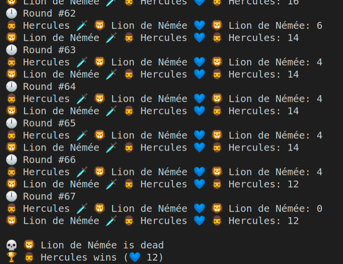

# The labours of Heracles - First of the labours: the Nemean lion

Prerequisite: clone this _repository_.

## Groundwork

Heracles must defeat the fierce Nemean lion, known for its impenetrable skin, making it very difficult to hurt. Before starting their quest, every hero should prepare a little:

In the empty _src/Fighter.js_ file, create:

- a constant `MAX_LIFE = 100`: fighters have 100 max life points

- a `Fighter` class with the properties:
  - name: name of the fighter.
  - strength: will be used to calculate the damage points during an attack.
  - dexterity: will be used to calculate the defense points that will limit the damage received.
  - life: initialized to MAX_LIFE, so they all start with 100 life points.

There would potentially be plenty of other things to add, but that's a good start!

Then, in the supplied _index.js_ file, create two instances of the Fighter class, for:

- 🧔 Heracles, strength 20, dexterity 6

- 🦁 Nemean Lion, strength 11, dexterity 13

To have a nice look even if you're working in the console, you can add an icon in the name string (https://emojipedia.org/).
You can also have fun varying the values, but the ones provided will give you relatively balanced fights.

> 💡**HINT**: a _constructor_ will be needed in your class to initialize these properties with different values for Heracles and the Lion.

> 💡**HINT**: don't forget to _require_ your _Fighter.js_ file if you want to be able to use it from your _index.js_ file.

After both objects have been instantiated, display the name and life 💙 (you should start at 100) of each of the two fighters to make sure everything is working fine. For now, you'll be using JS only in CLI mode.
To do so, just type: `node index.js` in your terminal.

## FIGHT !

Heracles warmed up a bit, tightened his muscles, crushed some rocks with his bare hands. He's ready to do battle!

Create a `fight ()` method that will allow you to attack the enemy. To determine who you are going to attack, the `fight ()` method will take another Fighter object as a parameter! In the body of your method, you will first calculate the number of damage points of the attacker:

- The fighter will hit with more or less success each time, the number of points of damage that the ** attacker ** does will therefore be a random number between 1 and the strength of the fighter (use `Math.random ()` ([Documentation](https://developer.mozilla.org/en-US/docs/Web/JavaScript/Reference/Global_Objects/Math/random), and if needed some advices from [this article](https://dev.to/rocambille/how-to-roll-a-dice-in-javascript-51j0))

- But the attacked can defend and dodge! You will therefore mitigate the damage by subtracting the damage from the dexterity of the **attacked** (without **never going below zero**)

- Once the damage is calculated, decrease the number of life points of the **attacked** by the value thus obtained. Be careful, the life of a fighter **cannot fall below zero**, also remember to check that

In summary :

```
attacked's new life points = attacked's current life points - (attacker's damage - attacked's dexterity)
```

knowing that `(attacker's damage - attacked's dexterity)` must not be negative.

There you go, your class is ready, you just have to use it!

## 🗡️ There can be only one

Heracles enters the cave, the lion is there, his red eyes pointed towards the intruder. The fight is imminent:

1. In the _index.js_ file, create a loop for performing a fight to the death! As long as one of the two enemies has a health > 0, the combat therefore continues.

2. In each "round" 🕛, Heracles attacks the lion, then the lion attacks Heracles. You have to display the round number, who attacks who, and the remaining life points.

3. When one of the two is defeated, you must then display the winner 🏆 and the loser 💀. The screenshot below gives you a summary of what to expect.



🎁 BONUS: create a new `isAlive ()` method to help you optimize the code.

## Conclusion

Once you're done, feel free to tweak the code and add new features.
You will be given a "clean" code at the start of the next workshop.
